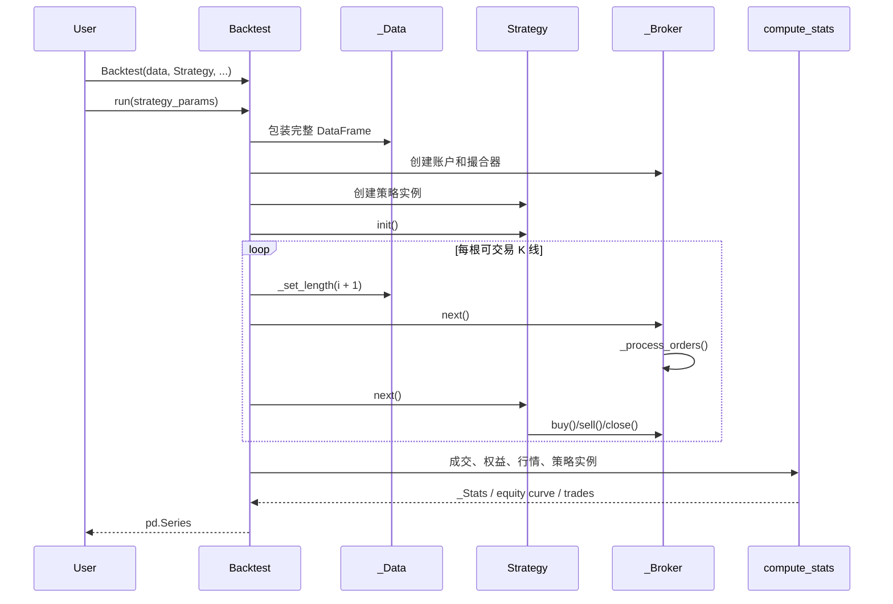

# Backtesting.py 源码架构学习目标

> 阅读基线：`cadcbe2`（`master`）<br>
> 学习方式：以源码架构阅读为主，不以编写新策略或修改框架为目标。

## 1. 总目标

完成本路线后，应能不依赖教程，独立说明 Backtesting.py 如何把一份 OHLC(V) 数据、一个 `Strategy` 子类和一组回测参数转换为订单、成交、权益曲线与统计结果。

最终需要掌握五件事：

1. 从公开 API 追踪到内部数据、撮合和统计模块。
2. 解释框架如何逐根 K 线暴露数据，并避免策略读取未来数据。
3. 解释市价、限价、止损、止盈和组合订单的创建与撮合顺序。
4. 解释现金、保证金、手续费、价差、持仓和权益如何共同变化。
5. 判断该框架适合解决什么问题，以及哪些需求需要更完整的交易系统。

## 2. 先建立系统全景

### 2.1 模块职责

| 模块 | 主要职责 | 阅读重点 |
|---|---|---|
| [`backtesting/__init__.py`](backtesting/__init__.py) | 顶层导出与优化使用的进程池入口 | 公开 API 为什么只有少数对象；不同进程启动方式的兼容处理 |
| [`backtesting/backtesting.py`](backtesting/backtesting.py) | 策略 API、订单领域对象、撮合、回测循环、参数优化 | 整个框架的主干 |
| [`backtesting/_util.py`](backtesting/_util.py) | 数据包装、指标包装、预热期、共享内存 | 渐进数据暴露和并行优化的数据传输 |
| [`backtesting/_stats.py`](backtesting/_stats.py) | 权益、回撤、交易明细和绩效指标 | 输入数据如何变成结果 `Series` |
| [`backtesting/_plotting.py`](backtesting/_plotting.py) | Bokeh 图表与大数据重采样 | 展示层怎样只消费回测结果，不参与交易逻辑 |
| [`backtesting/lib.py`](backtesting/lib.py) | 组合策略、统计辅助、多标的包装 | 如何在核心之上通过继承与组合扩展能力 |
| [`backtesting/test/_test.py`](backtesting/test/_test.py) | 行为规格与边界场景 | 当文档描述不够精确时，以测试确认真实语义 |
| [`doc/examples`](doc/examples) | 从用户 API 进入框架的示例 | 用最小策略连接外部用法和内部实现 |

### 2.2 核心运行链路



最重要的顺序是：每根 K 线上先执行 `broker.next()`，处理此前已经进入队列的订单，再调用 `strategy.next()` 产生新订单。这个顺序决定了默认市价单通常在下一根 K 线开盘成交，也解释了为什么回测不会在同一次策略调用中“先看收盘价、再以同一收盘价无条件成交”。

## 3. 核心对象关系

### 3.1 用户可见对象

- [`Strategy`](backtesting/backtesting.py#L41)：策略扩展点；`init()` 负责预计算，`next()` 负责逐根决策。
- [`Backtest`](backtesting/backtesting.py#L1111)：协调者；负责验证输入、装配依赖、运行循环、优化和绘图。
- [`Position`](backtesting/backtesting.py#L328)：当前净持仓的只读视图及整体平仓入口。
- [`Order`](backtesting/backtesting.py#L385)：待执行指令，保存方向、数量、限价、止损触发价和关联交易。
- [`Trade`](backtesting/backtesting.py#L543)：已开仓交易，保存开平仓价格、时间、盈亏以及 SL/TP 附属订单。

### 3.2 内部关键对象

- [`_Data`](backtesting/_util.py#L156)：把 DataFrame 列包装成高效数组，并通过改变“当前长度”模拟时间推进。
- [`_Indicator`](backtesting/_util.py#L152)：带绘图与索引元数据的 `ndarray` 子类。
- [`_Broker`](backtesting/backtesting.py#L726)：维护现金、订单、活动交易、已关闭交易和权益曲线，并承担撮合职责。
- [`_Stats`](backtesting/_stats.py#L193)：在 `pd.Series` 上提供适合阅读的结果表现形式。

理解对象时不要只看类名，应追踪其所有权：

- `Backtest` 创建并拥有本次运行所用的 `_Data`、`_Broker` 和 `Strategy`。
- `Strategy` 持有 `_Broker` 与 `_Data` 的引用，但不能直接操纵现金和成交结果。
- `Position`、`Order`、`Trade` 都通过 `_Broker` 读取或改变交易状态。
- `_Broker` 是订单、交易和现金状态的唯一事实来源。

## 4. 分阶段阅读路线

### 阶段一：从公开 API 进入主循环

**阅读顺序**

1. [`README.md`](README.md) 中的 `SmaCross` 示例。
2. [`backtesting/__init__.py`](backtesting/__init__.py) 的顶层导出。
3. [`Strategy`](backtesting/backtesting.py#L41) 的构造、`I()`、`init()`、`next()`、`buy()` 和 `sell()`。
4. [`Backtest.__init__`](backtesting/backtesting.py#L1195) 与 [`Backtest.run`](backtesting/backtesting.py#L1271)。

**学习目标**

- 能画出 `Backtest(...).run()` 创建对象和调用方法的顺序。
- 能说明策略参数为何必须先定义为类变量。
- 能解释 `Strategy.I()` 除了计算指标，还记录了哪些绘图和索引元数据。
- 能解释指标预热期为什么改变实际回测起点。

**完成标准**

不看源码，能复述 `Backtest.run()` 从初始化到返回 `_Stats` 的完整步骤。

### 阶段二：理解时间推进与数据隔离

**阅读顺序**

1. [`_Array`](backtesting/_util.py#L96) 与 [`_Indicator`](backtesting/_util.py#L152)。
2. [`_Data`](backtesting/_util.py#L156) 的 `_set_length()`、`_update()`、`df` 和 `__get_array()`。
3. `Backtest.run()` 中指标切片和 `data._set_length(i + 1)` 的循环。
4. `_indicator_warmup_nbars()` 及相关测试。

**学习目标**

- 区分 `Strategy.init()` 看到的完整数据和 `Strategy.next()` 看到的局部数据。
- 解释为什么底层数组可以预先存在，但策略仍只能访问当前切片。
- 识别通过 `.s`、`.df` 转回 Pandas 对象的成本与用途。
- 理解指标前置 `NaN`、最大回看窗口和首个交易 bar 的关系。

**关键问题**

- 如果策略在 `init()` 中把完整 `Close` 数组保存到普通属性而不使用 `self.I()`，框架还能否阻止未来数据泄漏？
- 为什么 `_Data` 通过清空切片缓存推进时间，而不是每根 K 线复制一份 DataFrame？

### 阶段三：建立订单与交易状态模型

**阅读顺序**

1. [`Position`](backtesting/backtesting.py#L328)。
2. [`Order`](backtesting/backtesting.py#L385)。
3. [`Trade`](backtesting/backtesting.py#L543)。
4. `_Broker.new_order()` 和 `Trade.__set_contingent()`。

**学习目标**

- 区分“订单”“活动交易”“净持仓”三个层次。
- 解释小于 1 的 `size` 为什么表示权益比例，大于等于 1 的整数为什么表示单位数量。
- 解释 `Position.close()`、`Trade.close()` 和反向下单的语义差异。
- 理解止损与止盈如何表示为关联到父交易的 contingent order。
- 理解 `exclusive_orders` 和 `hedging` 如何影响反向订单。

**完成标准**

能够分别描述以下状态变化：新开多仓、部分平仓、完全平仓、反向订单、止损触发、止盈触发。

### 阶段四：精读撮合引擎

**阅读顺序**

1. [`_Broker.__init__`](backtesting/backtesting.py#L727)：账户初始状态。
2. [`_Broker.next`](backtesting/backtesting.py#L855)：每根 K 线的撮合入口与爆仓处理。
3. [`_Broker._process_orders`](backtesting/backtesting.py#L875)：触发条件、成交价格和订单队列。
4. `_reduce_trade()`、`_close_trade()`、`_open_trade()`。
5. `backtesting/test/_test.py` 中订单、佣金、点差、止损止盈和 `trade_on_close` 测试。

**学习目标**

- 解释市价单、限价单、止损市价单、止损限价单各自使用哪个价格成交。
- 解释 `trade_on_close` 如何改变市价单成交时点。
- 解释 spread 与 commission 分别影响价格还是现金。
- 说明保证金可用额、杠杆和最大可开仓数量的计算关系。
- 理解同一根 OHLC 内同时触发入场与 SL/TP 时为何存在不可判定的价格路径。
- 解释框架何时递归重新处理 contingent orders。

**必须明确的模型限制**

- 输入只有 OHLC 时，无法知道 bar 内 `Open → High → Low → Close` 的真实先后路径。
- 成交模型不包含订单簿深度、排队位置、冲击成本和部分成交概率。
- `_Broker` 是研究用撮合器，不是实盘经纪商适配层。

### 阶段五：理解结果与统计层

**阅读顺序**

1. [`compute_stats`](backtesting/_stats.py#L37)。
2. `compute_drawdown_duration_peaks()` 和 `geometric_mean()`。
3. `Backtest.run()` 末尾构造 equity 与调用 `compute_stats()` 的部分。
4. [`plot`](backtesting/_plotting.py#L198) 如何消费 `_equity_curve`、`_trades` 和指标。

**学习目标**

- 能从 `Trade` 列表还原 `_trades` DataFrame 的字段来源。
- 能解释权益曲线、回撤、年化收益、波动率、Sharpe、Sortino、Calmar 和 SQN 的计算输入。
- 能区分公开统计字段与 `_strategy`、`_equity_curve`、`_trades` 三个内部结果对象。
- 理解绘图层为什么不应反向影响回测状态。
- 注意统计实现中对时间索引频率、周末交易与一年交易日数量的假设。

### 阶段六：理解参数优化与并行化

**阅读顺序**

1. [`Backtest.optimize`](backtesting/backtesting.py#L1386)。
2. `_optimize_grid()` 与 `_optimize_sambo()`。
3. `Backtest._mp_task()`。
4. [`SharedMemoryManager`](backtesting/_util.py#L278) 与 [`Pool`](backtesting/__init__.py)。
5. [`MultiBacktest`](backtesting/lib.py#L568)。

**学习目标**

- 区分穷举网格、随机网格和 SAMBO 模型优化。
- 解释 `constraint`、`maximize`、`max_tries` 和 `return_heatmap` 的作用。
- 理解行情数据为什么通过共享内存传给 worker，而不是为每组参数重复序列化。
- 解释为什么 worker 只返回不以下划线开头的统计字段。
- 明确 `MultiBacktest` 是“同一策略在多份数据上分别运行”，不是共享现金和风险预算的多资产组合引擎。

### 阶段七：把测试当作行为规格

**阅读方式**

按以下主题在 [`backtesting/test/_test.py`](backtesting/test/_test.py) 中检索，而不是从头顺读：

1. `commission`、`spread`、`margin`。
2. `trade_on_close`、`exclusive_orders`、`hedging`。
3. `sl`、`tp`、`limit`、`stop`。
4. `finalize_trades` 与回测末尾未平仓交易。
5. `optimize`、`compute_stats`、`plot`。

**学习目标**

- 找出文档描述与精确行为之间的差距。
- 用测试数据手工推演一个订单的成交价、手续费和最终现金。
- 理解修复撮合类缺陷时为什么必须增加最小行情序列测试。

## 5. 建议重点追踪的四条调用链

### 5.1 指标链

`Strategy.init()` → `Strategy.I()` → `_Indicator` → `_indicator_warmup_nbars()` → `Backtest.run()` 中逐步切片 → `Strategy.next()`

### 5.2 下单与成交链

`Strategy.buy()/sell()` → `_Broker.new_order()` → `orders` 队列 → `_Broker.next()` → `_process_orders()` → `_open_trade()`

### 5.3 平仓链

`Position.close()/Trade.close()` → contingent close order → `_process_orders()` → `_reduce_trade()` 或 `_close_trade()` → `closed_trades`

### 5.4 结果链

`broker._equity + broker.closed_trades` → `compute_stats()` → `_Stats` → `Backtest.plot()` → `_plotting.plot()`

## 6. 阅读时应记录的架构判断

建议每个阶段都用同一模板记录：

```text
模块/对象：
它负责什么：
它不负责什么：
输入与输出：
状态由谁拥有：
主要调用者：
关键不变量：
失败或警告条件：
如果扩展，最合适的边界在哪里：
```

重点寻找以下不变量：

- `Order.size` 不能为零，且方向由正负号表达。
- 多头和空头订单的 SL、入场价、TP 必须保持合法价格顺序。
- `_Broker` 的订单列表、活动交易列表和已关闭交易列表必须保持一致。
- 数据当前长度与策略看到的指标切片长度必须一致。
- 关闭交易时必须同步移除其 SL/TP 订单并结算两端手续费。

## 7. 项目边界与迁移启示

Backtesting.py 最适合学习一个紧凑、单标的、事件驱动回测内核。它清楚展示了策略 API、渐进数据、撮合、交易状态和统计之间的边界。

它不应被误解为完整量化交易系统：

- 没有行情采集、数据版本治理和企业级数据质量流程。
- 没有实盘网关、订单回报对账、断线恢复和持久化状态机。
- 没有共享资金的原生多资产投资组合与组合级风险引擎。
- 没有基于逐笔、盘口和交易所规则的高保真成交仿真。
- 参数优化本身不提供完整的训练集、验证集和样本外研究流程。

将其经验迁移到个人量化系统时，最值得保留的是边界，而不是复制整个实现：

```text
Strategy API
    ↓
Event Loop / Clock
    ↓
Broker & Fill Model
    ↓
Portfolio / Accounting
    ↓
Statistics & Reporting
```

数据接入、因子研究、组合构建、风控、实盘执行和监控应在这些边界之外独立设计。

## 8. 学习完成验收

满足以下条件即可认为源码架构阅读完成：

- [ ] 能在 10 分钟内画出主要模块和对象关系。
- [ ] 能逐行讲清 `Backtest.run()` 主循环的执行顺序。
- [ ] 能解释为什么策略新建的默认市价单不会立即在当前调用中成交。
- [ ] 能推演一个带 commission、spread、SL、TP 的交易生命周期。
- [ ] 能指出未来数据泄漏可能绕过 `_Data` 保护的方式。
- [ ] 能说明 `_process_orders()` 中最难处理的同 bar 歧义。
- [ ] 能从 `_Stats` 中追溯任一主要指标的数据来源。
- [ ] 能解释参数优化的共享内存与多进程边界。
- [ ] 能列出至少五项从研究回测走向实盘系统时必须新增的能力。

## 9. Fork 与上游同步

本地仓库的远端约定：

```text
origin   https://github.com/PancrasDuan/backtesting.py.git
upstream https://github.com/kernc/backtesting.py.git
```

学习期间建议保留 `master` 用于跟踪上游，在单独分支记录实验或注释。更新上游时先获取 `upstream`，再明确比较变更，不要直接覆盖本地学习记录。
