# Backtesting.py 源码架构学习指南

> 基线、定位与完成结果：本文绑定源码基线 `cadcbe2`。它面向能阅读 Python、NumPy 与 Pandas 的学习者，目标不是教你写一个“能跑”的策略，而是让你能从公开 API 一直追到数据窗口、撮合、账户、统计和并行优化，并能说清这些边界为何这样划分。重要判断均给出仓库相对路径或符号；行号只作辅助，符号名才是长期定位点。

完成本文后，你应能独立回答：一份 OHLC(V) `DataFrame`、一个 `Strategy` 子类和一组参数，怎样经过 `Backtest.run` 变成 `Order`、`Trade`、权益曲线、`_Stats` 与图表；又有哪些结论只是研究型 bar 回测的模型假设。

## 如何使用这份指南

推荐把阅读拆成三轮，而不是从头到尾只读一次。

1. **第一轮，建立地图（约 45 分钟）**：读“系统全景”“完整旅程”和每阶段的“本阶段要回答的问题”，先知道对象在哪里、状态归谁。
2. **第二轮，跟源码走（每阶段 60～90 分钟）**：按“推荐源码顺序”打开文件，在本地搜索符号，不依赖本文行号。每遇到一个判断，就用源码和测试各找一次证据。
3. **第三轮，脱离文档复述（约 60 分钟）**：手画图、手推交易、回答检查项。说不清的地方回到调用者与状态所有者，而不是只重读某个函数。

本文采用统一的七阶段模板：**本阶段要回答的问题 → 推荐源码顺序 → 核心机制解释 → 可视化 → 源码观察点 → 常见误解与边界 → 动手推演或自测 → 完成检查**。所有 Mermaid 图旁边都有文字解释；即使渲染器不支持 Mermaid，正文也可独立阅读。

阅读时准备两个窗口：一个打开本文，另一个在仓库根目录运行 `rg -n "符号名" backtesting`。优先阅读以下事实源：

| 事实源 | 适合回答的问题 |
|---|---|
| [`backtesting/backtesting.py`](backtesting/backtesting.py) | 策略 API、领域对象、撮合、主循环、优化 |
| [`backtesting/_util.py`](backtesting/_util.py) | 渐进数据窗口、指标包装、共享内存 |
| [`backtesting/_stats.py`](backtesting/_stats.py) | 交易与权益如何转成统计结果 |
| [`backtesting/_plotting.py`](backtesting/_plotting.py) | 图表怎样消费结果而不改变交易状态 |
| [`backtesting/lib.py`](backtesting/lib.py) | 核心之上的组合工具与 `MultiBacktest` |
| [`backtesting/test/_test.py`](backtesting/test/_test.py) | 参数、成交和边界场景的可执行行为规格 |

## 一张图建立系统全景

先把系统分成六层：公开入口、策略、数据时钟、交易状态、结果、并行包装。箭头表示主要调用或数据流，不表示继承。

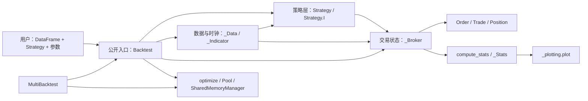

模块职责要用“负责什么/不负责什么”成对理解：

| 模块 | 负责 | 明确不负责 |
|---|---|---|
| [`backtesting/__init__.py`](backtesting/__init__.py) | 导出 `Backtest`、`Strategy`；提供可覆盖的 `Pool` | 不实现策略或撮合 |
| [`backtesting/backtesting.py`](backtesting/backtesting.py) | 装配、事件循环、订单领域对象、撮合与优化入口 | 不做行情采集；不画 Bokeh 图 |
| [`backtesting/_util.py`](backtesting/_util.py) | 数组包装、窗口长度、预热、共享内存转换 | 不决定买卖，不计算绩效结论 |
| [`backtesting/_stats.py`](backtesting/_stats.py) | 将 closed trades、equity、OHLC 变成结果 | 不改变订单、现金或仓位 |
| [`backtesting/_plotting.py`](backtesting/_plotting.py) | 将 `_equity_curve`、`_trades`、指标和 OHLC 变成图 | 不参与成交和账户核算 |
| [`backtesting/lib.py`](backtesting/lib.py) | 在核心之上组合策略、重算统计、包装多数据集 | `MultiBacktest` 不是共享资金组合引擎 |

对象所有权比模块依赖更重要。一次 `run()` 会新建运行期 `_Data`、`_Broker` 和 `Strategy`；策略只持有引用。`_Broker` 持有唯一可变的订单、活动交易、已关闭交易、现金和权益记录，`Position` 只是它的净持仓视图。

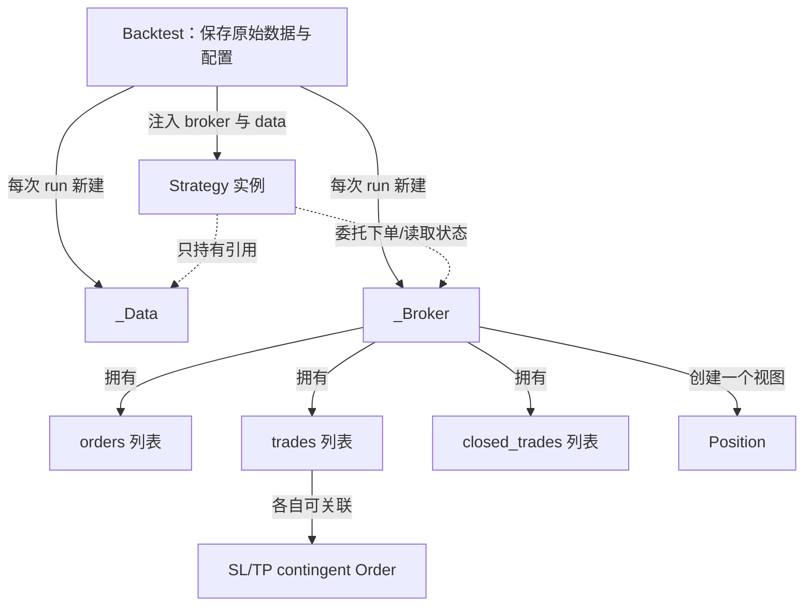

由此得到第一条架构不变量：**交易状态的唯一事实来源是 `_Broker`**。策略、`Position`、`Order`、`Trade` 都不能各自维护一份独立“账户真相”；否则取消订单、部分平仓、手续费与统计会立刻失去一致性。

## 一次回测的完整旅程

从构造到结果共有九个动作：验证并保存输入；创建运行期对象；参数校验；`init()` 全量预计算；刷新数据；计算预热起点；逐 bar 先撮合后决策；可选收尾平仓；补齐权益并统计。

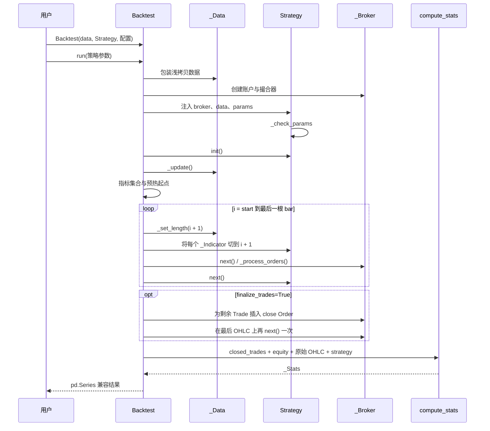

经基线 `cadcbe2` 核对，[`Backtest.run`](backtesting/backtesting.py#L1271) 主循环的等价骨架是：

```python
for i in range(start, len(original_data)):
    data._set_length(i + 1)
    for attr, indicator in indicator_attrs:
        setattr(strategy, attr, indicator[..., :i + 1])
    broker.next()
    strategy.next()
```

顺序不能随意交换。`strategy.next()` 在当前 bar 接近收盘时观察已完成的 OHLC，并把新订单放入队列；默认市价单要等下一次 `broker.next()` 才按下一 bar 的 `Open` 撮合。若 `trade_on_close=True`，非 contingent 的纯市价单在下一次撮合时改用前一 bar `Close`，并把交易时间索引记在前一 bar。它仍不是在同一次策略调用内同步执行。

## 阶段1：从公开 API 进入主循环

### 本阶段要回答的问题

- `Backtest.__init__` 保存了什么，为什么不立刻运行？
- 策略参数为什么必须先是类属性？`Strategy.I` 比普通函数调用多做了什么？
- `Backtest.run` 怎样装配对象、决定起点并返回结果？

### 推荐源码顺序

1. [`backtesting/__init__.py`](backtesting/__init__.py) 的公开导出与 `Pool`。
2. [`Strategy._check_params`](backtesting/backtesting.py#L65)、[`Strategy.I`](backtesting/backtesting.py#L77)、`buy()`、`sell()` 与数据/交易视图属性。
3. [`Backtest.__init__`](backtesting/backtesting.py#L1195)：数据类型、OHLC、索引、参数与 broker 工厂的校验。
4. [`Backtest.run`](backtesting/backtesting.py#L1271)：从对象装配读到 `compute_stats()`。

### 核心机制解释

`Backtest.__init__` 是配置阶段：它校验 `Strategy` 子类、复制数据外壳、补 `Volume`、检查 OHLC 非空且无缺失、必要时排序索引，然后保存 `_broker = partial(_Broker, ...)`。这样同一个 `Backtest` 可以多次 `run()`，每次获得隔离的新账户和新策略实例。

`Strategy.__init__` 调用 `_check_params`。每个传入参数必须能通过 `hasattr(self, name)` 找到，随后才 `setattr` 覆盖，因此优化参数要先在策略类上声明。这既能尽早发现拼写错误，也让参数空间不是任意注入的新属性。

`Strategy.I(func, ...)` 在 `init()` 中立即用全量数据计算：它规范化名称，将 `DataFrame` 转成二维数组，检查结果是一至二维且最后一维与数据等长，并包装成带 `name`、绘图选项、索引元数据的 `_Indicator`。运行循环再把策略属性替换成逐步切片。指标计算本身是向量化的，“可见性”才是逐 bar 的。

### 可视化

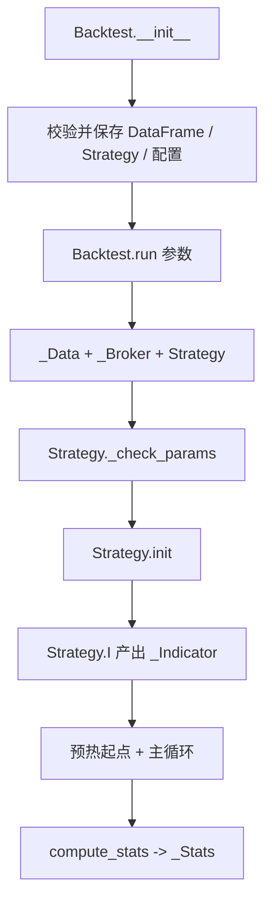

### 源码观察点

- `Backtest.__init__` 对原 `DataFrame` 使用 `copy(deep=False)`，随后运行时又创建浅拷贝；测试 `test_dont_overwrite_data` 约束外部数据不应被覆盖。
- `Strategy.I` 的转置规则要结合形状检查读：若第一维等于数据长度，会尝试转置，最后要求 `value.shape[-1] == len(data)`。
- `start = 1 + _indicator_warmup_nbars(strategy)` 中的 `+1` 保证至少两条记录，方便 `[-2]` 等访问。
- 返回值虽标注为 `pd.Series`，实际由 `_Stats(pd.Series)` 提供更适合完整展示的 `repr`。

### 常见误解与边界

- **误解：** `init()` 每根 bar 都运行。**事实：** 每次 `run()` 只运行一次，适合全量预计算。
- **误解：** `Strategy.I` 按 bar 重算指标。**事实：** 它先全量计算，再由主循环切片暴露。
- **误解：** 构造 `Backtest` 已经冻结一次结果。**事实：** 运行期状态在每次 `run()` 中重建。
- **边界：** 参数类属性检查是接口防线，不是参数类型或业务含义验证器。

### 动手推演或自测

定义类属性 `n = 10`，思考 `run(n=20)` 与 `run(nn=20)` 分别发生什么。再用纸写出 `Backtest.__init__ → Backtest.run → Strategy.__init__ → Strategy.init → Strategy.next` 中，哪些动作只发生一次，哪些按 bar 重复。

### 完成检查

- [ ] 我能从顶层 `Backtest` 定位到 `backtesting/backtesting.py` 的实现。
- [ ] 我能解释策略参数必须预先声明为类变量的原因。
- [ ] 我能说出 `Strategy.I` 保存的数组、名称、索引和绘图元数据。
- [ ] 我能逐行讲清 `Backtest.run` 主循环的四个动作及顺序。

## 阶段2：时间推进与未来数据隔离

### 本阶段要回答的问题

- 完整底层数组已经存在，框架为何仍能让 `next()` 只看到当前窗口？
- `_Data._set_length`、`_Data._update` 与 `_indicator_warmup_nbars` 各解决什么问题？
- 哪种写法会绕过保护，造成未来数据泄漏？

### 推荐源码顺序

1. [`_Array` 与 `_Indicator`](backtesting/_util.py#L96)：NumPy 子类及 `.s`、`.df` 访问器。
2. [`_Data`](backtesting/_util.py#L156)：重点读 `_set_length()`、`_update()`、`__get_array()`、`df` 和 `_current_value()`。
3. [`_indicator_warmup_nbars`](backtesting/_util.py#L87) 与 `Backtest.run` 的 `start`、指标切片。
4. [`backtesting/test/_test.py`](backtesting/test/_test.py) 中指标长度、NaN 预热和数据不变性测试。

### 核心机制解释

`_Data` 同时持有完整 `DataFrame`、由各列创建的完整 `_Array`、当前逻辑长度 `__len` 和按列切片缓存。`_set_length(i + 1)` 只改逻辑长度并清空缓存；下一次 `data.Close` 才从完整数组取 `[:current_length]`。这避免每根 bar 复制整张表。

`_update()` 的用途不同：`Strategy.init()` 可能经 `data.df` 增加或修改列，因此 `init()` 后运行一次 `_update()`，重建完整列数组。它不是时钟推进函数。

指标也必须同步缩短。`Strategy.I` 返回的完整 `_Indicator` 被保存在 `_indicators`，`Backtest.run` 识别策略属性中的指标，并在每轮把属性设为 `indicator[..., :i + 1]`。因此 `len(data)`、`data.Close` 和策略指标属性在 `next()` 中对齐。

预热值由 `_indicator_warmup_nbars()` 在非 scatter 指标上寻找前置 NaN 结束位置，再取所有指标中的最大值。回测从 `1 + warmup` 开始，所以最长回看指标决定可交易起点，也影响 Buy & Hold 基准的起算位置。

### 可视化

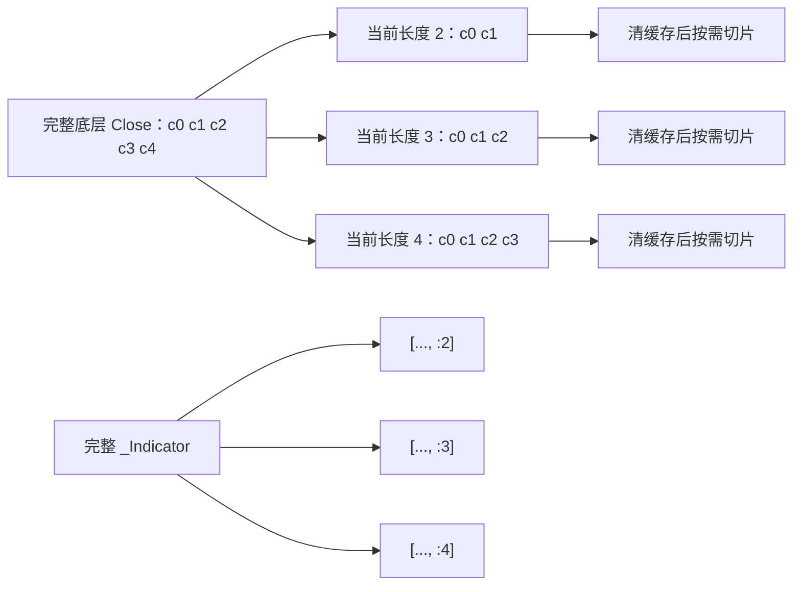

### 源码观察点

- `_Data.__get_array()` 返回的是切片视图并缓存；推进长度必须清缓存，否则策略可能继续拿到旧窗口。
- `_Data.df` 在当前长度小于全长时返回 `iloc[:length]`；`_Array.s`/`.df` 使用保存的索引前缀。
- `_current_value()` 走完整数组的快速路径，但索引仍由当前长度减一决定，主要供 `_Broker` 使用。
- `_Indicator` 本身没有新方法，行为来自 `_Array`；语义差异主要在 `_opts` 与使用场景。

### 常见误解与边界

- **误解：** 底层完整数组存在就必然泄漏。**事实：** 正常通过 `self.data` 和切片后的指标属性访问时，只能看到当前窗口。
- **真正风险：** `init()` 期间 `saved = self.data.Close` 得到当时的全长数组；若把它作为普通属性保存并在 `next()` 直接索引未来位置，而不通过 `self.I()` 的切片协议，框架不能替用户撤销这个引用。这是可绕过的未来数据泄漏。
- **误解：** `.s` 或 `.df` 能拿到未来数据。**事实：** 正常运行时它们按当前数组长度建 Pandas 对象；代价主要是对象构造和索引语义，而不是自动泄漏。
- **边界：** 框架提供可见性约定与默认安全路径，并非进程级沙箱；策略作者仍要遵守时间因果性。

### 动手推演或自测

假设两个指标前置 NaN 数分别为 4 和 9。写出 `warmup`、`start` 和第一次 `Strategy.next()` 所见的数据长度。再设计一段“错误但能运行”的代码：在 `init()` 保存全长 Close，在 `next()` 读取末尾值；解释为何它绕过 `_Data`。

### 完成检查

- [ ] 我能解释 `_set_length` 为什么清缓存而不复制 DataFrame。
- [ ] 我能区分 `_update` 与 `_set_length` 的职责。
- [ ] 我能说明数据窗口和 `_Indicator` 切片必须同长的不变量。
- [ ] 我能指出至少一种未来数据泄漏的绕过方式。

## 阶段3：订单、交易与持仓状态模型

### 本阶段要回答的问题

- `Order`、`Trade` 与 `Position` 分别表示意图、已成交事实还是汇总视图？
- `Position.close()`、`Trade.close()`、反向下单有什么不同？
- SL、TP 为什么也是订单，谁负责取消另一边？

### 推荐源码顺序

1. [`Position`](backtesting/backtesting.py#L328)：所有属性怎样委托给 broker。
2. [`Order`](backtesting/backtesting.py#L385)：size、limit、stop、parent trade 与 contingent 判定。
3. [`Trade`](backtesting/backtesting.py#L543)：开平仓字段、盈亏、`close()`、SL/TP setter。
4. [`_Broker.new_order`](backtesting/backtesting.py#L765) 与 `Trade.__set_contingent()`。

### 核心机制解释

`Order` 是等待处理的指令；size 正负表示方向，`0 < abs(size) < 1` 表示当前可用流动性的比例，绝对值大于等于 1 时必须是整数单位。订单成交后才产生 `Trade`。`Trade` 保存一个独立 lot 的 size、entry/exit price、bar、tag、累计佣金以及可选 SL/TP 订单。`Position` 不保存独立仓位，它动态汇总所有活动 `Trade`，所以同时存在多个 trade 时仍只有一个净视图。

`Trade.close(portion)` 不直接改成交记录，而是创建方向相反、带 `parent_trade` 的市价 close order，并插到队列前部。`Position.close(portion)` 对每个活动 trade 分别做同一动作。普通 `sell()` 则是新的独立订单：`hedging=False` 时撮合器会用 FIFO 抵消相反 trade，`hedging=True` 时可并存多空；它与“精确关闭某一 trade”不是同一接口。

开仓后，`Trade.sl = price` 创建反向 stop-market contingent order，`Trade.tp = price` 创建反向 limit contingent order。二者都关联父 trade，且 size 等于 `-trade.size`。父 trade 全部关闭时 `_close_trade()` 同步移除两张附属订单，形成 OCO 效果。

### 可视化

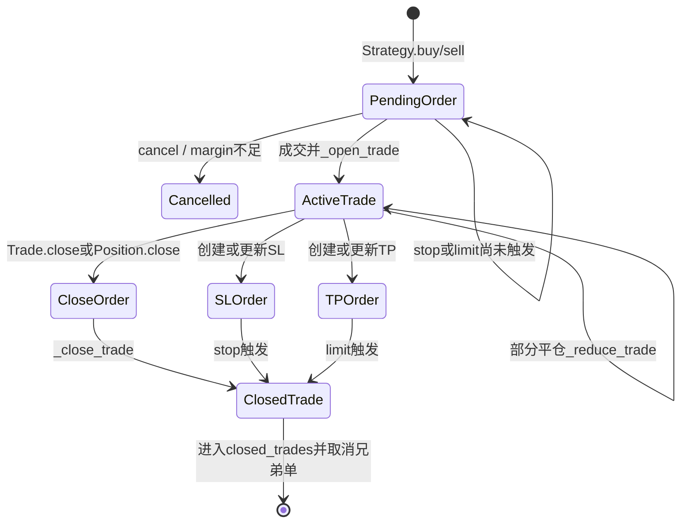

### 源码观察点

- `new_order()` 在创建时检查合法价格顺序：多头要求 `SL < 参考入场价 < TP`，空头相反；参考价会考虑 spread。
- `exclusive_orders=True` 会先取消非 contingent 挂单，再为每个活动 trade 插入 close order，然后把新单排队。
- broker 把 SL stop order 插到队首，使 SL 优先于随后检查的 TP；订单遍历使用 `list(self.orders)` 快照，并反复确认订单仍存在。
- 部分平仓时原 trade 缩小、SL/TP size 同步缩小，同时复制一个无 SL/TP 的部分 trade 交给 `_close_trade()` 记录。

### 常见误解与边界

- **误解：** `Position` 是唯一持仓实体。**事实：** 它是 broker 上多个活动 `Trade` 的净视图。
- **误解：** `sell(size=...)` 必然关闭对应 long。**事实：** 是否抵消、抵消多少受单位、价格、`hedging` 与 `exclusive_orders` 影响；要明确退出应使用 `Trade.close()` 或 `Position.close()`。
- **误解：** 设置 `sl`/`tp` 是在 trade 对象上保存两个数字。**事实：** setter 会取消旧单并新建 contingent `Order`。
- **边界：** 所有订单都是 Good-'Til-Canceled 风格；核心没有交易所时效类型、排队或部分成交概率模型。

### 动手推演或自测

画出两个 long trades（size 3 与 7）下调用 `position.close(.5)` 后进入队列的两张 close order 大小，并说明整数四舍五入和最小 1 单位规则。再比较同样状态下普通 `sell(size=5)` 在 `hedging=False/True` 的结果。

### 完成检查

- [ ] 我能用一句话区分 `Order`、`Trade` 和 `Position`。
- [ ] 我能解释部分平仓为何会创建一个已关闭 trade 副本。
- [ ] 我能解释 SL/TP 的 parent trade 与 OCO 取消关系。
- [ ] 我能说清 `exclusive_orders` 和 `hedging` 改变的是哪一步。

## 阶段4：精读撮合引擎

### 本阶段要回答的问题

- stop、limit、market 在单根 OHLC 上如何判断触发与价格？
- spread、commission、margin、trade_on_close 在哪一步影响结果？
- 为什么同 bar 内父订单与 SL/TP 都命中时无法完全确定？

### 推荐源码顺序

1. [`_Broker.__init__`](backtesting/backtesting.py#L727)：现金、手续费函数、杠杆、状态列表。
2. [`_Broker.next`](backtesting/backtesting.py#L855)：撮合入口、权益记录与爆仓路径。
3. [`_Broker._process_orders`](backtesting/backtesting.py#L875)：stop → limit/market → parent trade → 净额 → margin → open 的顺序。
4. [`_reduce_trade`](backtesting/backtesting.py#L1055)、[`_close_trade`](backtesting/backtesting.py#L1078)、[`_open_trade`](backtesting/backtesting.py#L1097)。
5. [`backtesting/test/_test.py`](backtesting/test/_test.py) 中 `test_spread_commission`、`test_commissions`、`test_trade_on_close_closes_trades_on_close`、`test_stop_entry_and_tp_in_same_bar` 等。

### 核心机制解释

`_Broker.next()` 先清除随价格变化的未实现盈亏缓存，把当前索引设为 `len(data)-1`，调用 `_process_orders()`，然后记录 `equity`。权益小于等于零时，它以当前 close 强制关闭 trade、把现金和后续权益置零并终止循环。

撮合读取当前 bar 的 `Open/High/Low`。先检查 stop：long stop 需 `High >= stop`，short stop 需 `Low <= stop`；命中后 stop 字段被清空，订单转成 market 或 limit。limit 命中条件是 long 的 `Low <= limit`、short 的 `High >= limit`。当 stop 与 limit 同 bar 都覆盖时，代码用保守规则排除“limit 在 stop 之前发生”的路径。

价格规则可压缩为下表：

| 类型 | 触发 | 基础成交价（未计 spread/commission） |
|---|---|---|
| 默认市价单 | 下一次 broker tick | 通常当前 `Open` |
| `trade_on_close=True` 的非 contingent 纯市价单 | 下一次 broker tick | 前一 bar `Close`，时间索引也记前一 bar |
| stop-market | High/Low 穿越 stop | long 取 `max(Open, stop)`；short 取 `min(Open, stop)`，体现跳空劣化 |
| limit | Low/High 覆盖 limit | long 取 `min(Open, limit)`；short 取 `max(Open, limit)`，可获开盘改善 |
| stop-limit | stop 先有效且 limit 可成交 | 根据 Open、stop、limit 及保守先后规则决定 |
| contingent SL/TP | 与父 trade 关联 | SL 是 stop-market，TP 是 limit；关闭价不再做独立 entry spread 调整 |

stand-alone 新开方向在 `_adjusted_price` 加 spread：long 乘 `1 + spread`，short 乘 `1 - spread`。commission 是独立现金流：可为比例、`(fixed, relative)` 或函数，开仓与平仓各收一次。margin 参数被转成 `leverage = 1 / margin`；它不把全部名义本金从现金扣掉，而是限制 `margin_available * leverage` 能支持的新增名义价值。

### 可视化

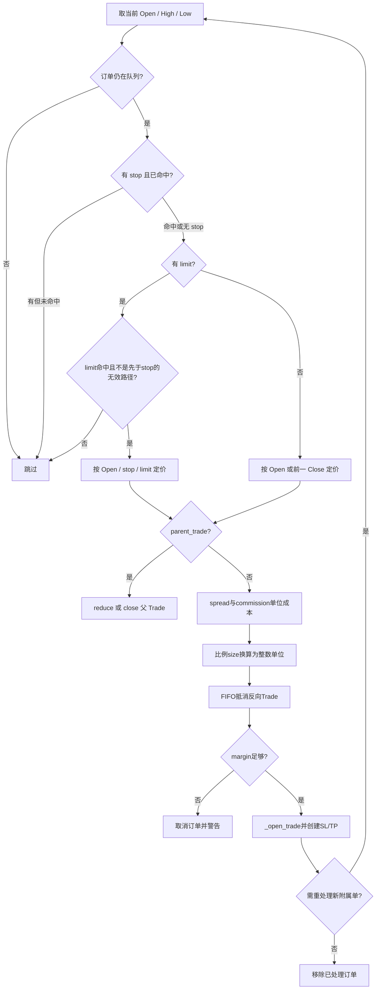

账户关系可用第二张图记忆；这里的“现金”不是现货钱包余额，而是该研究模型的结算变量。

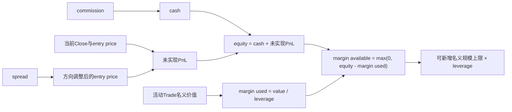

### 源码观察点

- 比例 size 的单位换算使用 `floor((margin_available * leverage * fraction) / adjusted_price_plus_commission)`；连一单位也买不起会取消并发出 margin 警告。
- `hedging=False` 时先 FIFO 关闭/缩减反向 trades，再检查剩余 `need_size` 是否能开新仓。
- `_open_trade()` 先扣开仓 commission，再按 TP 后 SL 的赋值顺序创建附属单；`new_order` 会把 SL 插到队首。
- `_close_trade()` 移除活动 trade 与两张附属单，写 exit 字段，现金增加毛 PnL 减退出 commission，并在 trade 上记录两端总 commission。
- 市价父订单开仓并带 SL/TP 时会递归 `_process_orders()`，因此附属单可能在同一 bar 被检查。

### 常见误解与边界

- **误解：** commission 与 spread 都是现金手续费。**事实：** spread 进入方向调整后的成交价，commission 单独改变现金并进入 trade 统计。
- **误解：** `margin=.1` 会扣掉 10% 的订单价值。**事实：** 它给出 10 倍 leverage，并通过 used/available margin 限制容量。
- **误解：** OHLC 同时覆盖 SL 与 TP 就能知道谁先发生。**事实：** bar 内路径未知；队列顺序和保守分支只是框架假设。
- **同 bar 歧义：** 对 stop/limit 父订单，若开仓 bar 又覆盖 SL/TP 且真实先后不可证，代码会警告并把受影响附属单推迟到下一匹配 bar；某些方向可确定的 stop-entry + TP 场景会立即重处理。对 market entry，新附属单直接重处理，SL 的队列优先级形成保守结果。不要把这些模型选择当成逐笔事实。
- **边界：** 没有订单簿、成交量容量、冲击成本、交易所排队、部分成交概率和逐笔价格路径。

### 动手推演或自测

不用运行代码，分别推演：long stop=105 遇到 `Open=108, High=110`；long limit=105 遇到 `Open=103, Low=102`；short stop-limit 的 stop 与 limit 都被 bar 覆盖但 limit 可能先发生。对每个场景写下“是否成交、基础价、是否存在路径歧义”。

### 完成检查

- [ ] 我能逐段解释 `_process_orders` 的判断顺序。
- [ ] 我能区分 market、limit、stop-market 与 stop-limit 的价格规则。
- [ ] 我能写出 equity、margin used 与 margin available 的关系。
- [ ] 我能指出 `_process_orders()` 中最难处理的同 bar 歧义。

## 阶段5：结果、统计与绘图

### 本阶段要回答的问题

- `broker._equity` 和 `closed_trades` 怎样变成 `_equity_curve`、`_trades` 与公开指标？
- 回撤持续时间、年化、Sharpe、Sortino、Calmar、SQN 的上游数据是什么？
- 绘图层为什么不应反向影响回测？

### 推荐源码顺序

1. `Backtest.run` 末尾：权益 `bfill/fillna` 与 `compute_stats()` 调用。
2. [`compute_drawdown_duration_peaks`](backtesting/_stats.py#L14) 与 [`compute_stats`](backtesting/_stats.py#L37)。
3. [`_Stats`](backtesting/_stats.py#L193)：它只改变显示，不改变计算。
4. [`_plotting.plot`](backtesting/_plotting.py#L198) 及重采样辅助函数。

### 核心机制解释

broker 在每次 `next()` 撮合后把当期 equity 写入预分配数组。循环结束后，`Backtest.run` 对尚未记录的前缀/空位做 backward fill，再以最终 cash 填剩余空值。`compute_stats` 同时接收 closed `Trade` 列表、完整 equity、原 OHLC 和策略实例。

若输入是 `Trade` 列表，`compute_stats` 逐字段构造 `_trades`：Size、Entry/ExitBar、Entry/ExitPrice、SL、TP、PnL、Commission、ReturnPct、时间、Duration、Tag，并用 bar 索引附加每个指标的入场/出场值。由 equity 计算峰值、收益和 `DrawdownPct = 1 - equity / cumulative_max(equity)`；`compute_drawdown_duration_peaks` 在权益重回峰值的区段上定位持续时间与峰值回撤。

年化指标依赖时间索引。实现先推断数据周期与是否含周末，再选择 252 或 365 等 annual trading days，将权益重采样为日/周/月/年收益。Sharpe 用年化收益减无风险利率后除年化波动，Sortino 使用下行收益平方均值，Calmar 用年化收益除最大回撤。交易层指标来自 `_trades`，例如 SQN 是 `sqrt(n_trades) * mean(PnL) / std(PnL)`。

最后公开结果与三个内部对象一起装进 `_Stats`：`_strategy`、`_equity_curve`、`_trades`。`Backtest.plot()` 再把原 OHLC、策略指标和结果传给 `_plotting.plot()`；绘图可重采样副本，但不把任何状态写回 broker。

### 可视化

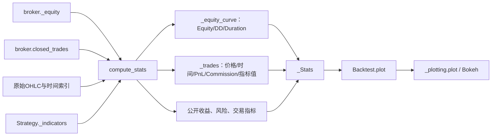

### 源码观察点

- Exposure Time 由 EntryBar 到 ExitBar 的 bar 覆盖率计算，不是按不规则时间间隔加权。
- Buy & Hold Return 从 `Close[warmup]` 起算，也就是首个指标有效 bar；主循环从 `1 + warmup` 开始，所以该基准起点是首次 `Strategy.next()` 之前一根 bar，而不是首次可交易 bar 或数据第一行。
- `Commissions [$]` 仅在佣金总和为真时加入公开字段；每笔 trade 仍有 Commission 列。
- `_plotting.plot` 先断言 OHLC 索引与 `_equity_curve` 索引一致，再复制/读取结果；交易为空时关闭若干图层。

### 常见误解与边界

- **误解：** `_Stats` 是一个独立数据库对象。**事实：** 它是 `pd.Series` 子类，核心差异是完整显示行为。
- **误解：** 任何索引都能得到同样可信的年化指标。**事实：** 非 DatetimeIndex 或不规则频率会削弱/改变时间推断。
- **误解：** 图表重新计算了成交。**事实：** 它消费已生成的 OHLC、指标、权益和交易表，只做展示/重采样。
- **边界：** 指标公式含年化天数、周末交易和复利方式假设；比较外部库前先核对定义。

### 动手推演或自测

任选一个公开指标，写出反向追踪路径。例如 `Max. Drawdown [%] → dd.max() → equity / cumulative max → broker._equity → cash + unrealized PnL`。再任选 SQN，说明它为什么不直接依赖 OHLC。

### 完成检查

- [ ] 我能从 `_Stats` 中追溯任一主要指标的数据来源。
- [ ] 我能区分公开统计字段与三个下划线内部结果对象。
- [ ] 我能解释回撤幅度与回撤持续时间的不同输入。
- [ ] 我能说明绘图层为何是结果消费者而不是交易参与者。

## 阶段6：参数优化与并行化

### 本阶段要回答的问题

- 穷举网格、随机网格与 SAMBO 分别怎样决定试验点？
- `SharedMemoryManager`、`Pool`、`Backtest._mp_task` 在主进程/worker 边界上各做什么？
- `MultiBacktest` 为什么不是多资产组合回测？

### 推荐源码顺序

1. [`Backtest.optimize`](backtesting/backtesting.py#L1386)：参数校验、grid 与 sambo 两条分支。
2. `_optimize_grid()` 的组合、batch、heatmap 与最佳参数复跑；`_optimize_sambo()` 的目标函数与缓存。
3. [`Backtest._mp_task`](backtesting/backtesting.py#L1647)。
4. [`SharedMemoryManager`](backtesting/_util.py#L278) 的 `df2shm()`、`shm2df()` 与退出清理。
5. [`Pool`](backtesting/__init__.py#L75) 和 [`MultiBacktest`](backtesting/lib.py#L568)。

### 核心机制解释

grid 先做参数笛卡尔积并应用 `constraint`。`max_tries=None` 是穷举；`0 < max_tries <= 1` 表示近似抽样比例；正整数换算为相对全空间的抽样概率，因此是随机网格而非“按固定前 N 个”。每个可接受组合成为 heatmap 的 MultiIndex。

主进程用 `SharedMemoryManager.df2shm()` 把 index 与各列复制到共享内存，只把名称、shape、dtype 元数据和参数 batch 发送给 `Pool` worker。`Backtest._mp_task` 用只读共享数组重建 DataFrame，逐组 `run()`，有交易时只返回不以下划线开头的公开统计字段，无交易返回 `None`，最后关闭 worker 句柄。主进程填 heatmap，再在自己这里用最佳参数完整复跑，取得含 `_strategy`、`_equity_curve`、`_trades` 的完整结果。

SAMBO 是模型驱动搜索：把各参数映射为整数/浮点区间或类别集合，以负的 `maximize(stats)` 作为最小化目标，用缓存避免重复评估；`constraint` 仍控制可接受点。它默认最多 200 次，不使用 grid 分支的共享内存 worker 路径，而是在当前优化流程中调用 `self.run()`。

`backtesting.Pool` 是可覆盖入口。若启动方式为 `spawn`，默认实现发出警告并退化为线程池；用户可在主模块保护下覆盖成所需进程上下文。`MultiBacktest.run` 复用共享内存与 Pool，让同一策略在多份数据上分别运行并把统计列拼成 DataFrame；每份数据都有独立现金、broker 和统计。它不做跨资产净值、共享 margin 或组合风控。

### 可视化

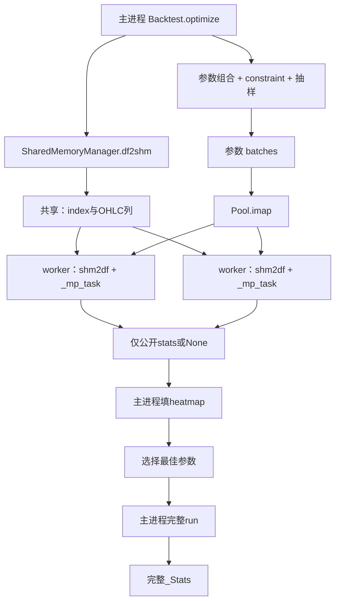

### 源码观察点

- `patch(self, '_data', None)` 后复制 `Backtest`，避免把原 DataFrame 随对象再次序列化；worker 再从共享内存赋回 `_data`。
- `SharedMemoryManager.__exit__` 由创建者 close 并 unlink；worker 只 close 自己附着的句柄。
- 参数组合用 `_batch()` 分批，batch 大小按组合数和 CPU 数裁剪在 1～300。
- `MultiBacktest.optimize()` 顺序遍历数据集，因为单个 `bt.optimize()` 自己已经做并行。

### 常见误解与边界

- **误解：** `max_tries=100` 一定试恰好 100 组。**事实：** grid 分支用概率筛选，数量近似且还受 constraint 影响。
- **误解：** worker 返回完整 `_Stats`。**事实：** 为减小跨进程传输，只保留公开字段，最佳组合随后由主进程完整复跑。
- **误解：** `Pool` 永远是多进程。**事实：** spawn 默认路径可退化为线程池，并给出覆盖建议。
- **误解：** `MultiBacktest` 能模拟共享资金的多资产组合。**事实：** 它是多份独立 Backtest 的并行比较包装。
- **边界：** 参数优化并不自动提供训练/验证/样本外切分，也不防止多重试验过拟合。

### 动手推演或自测

给定 `fast=[5,10]`、`slow=[20,30,40]` 与 `constraint=lambda p: p.fast < p.slow`，写出完整网格大小。再画出“`_optimize_grid` 每生成一个参数 batch，就调用一次 `smm.df2shm(self._data)` 并复制到一组新的共享内存段；这样避免的是每个参数组合各自重复序列化 DataFrame，而不是整个优化只复制一次”的序列化边界。

### 完成检查

- [ ] 我能区分穷举 grid、随机 grid 与 SAMBO。
- [ ] 我能解释共享内存与多进程分别减少和没有减少什么成本。
- [ ] 我能说明 worker 为什么过滤下划线字段。
- [ ] 我能说明 `MultiBacktest` 与共享资金组合引擎的差别。

## 阶段7：把测试当作行为规格

### 本阶段要回答的问题

- 当 docstring、直觉和撮合实现看起来不一致时，怎样用最小测试确认语义？
- 哪些测试锁定了 commission、spread、margin、SL/TP 和收尾行为？
- 修改撮合时怎样避免只修一个样例、破坏另一种订单？

### 推荐源码顺序

不要从头顺读 [`backtesting/test/_test.py`](backtesting/test/_test.py)，按行为搜索：

1. `test_spread_commission`、`test_commissions`、包含 `margin` 警告的场景。
2. `test_broker_hedging`、`test_broker_exclusive_orders`。
3. `test_trade_on_close_closes_trades_on_close`。
4. `test_trade_enter_hit_sl_on_same_day`、`test_stop_entry_and_tp_in_same_bar`、`test_sl_always_before_tp`、跳空穿越 SL 的回归测试。
5. `test_close_orders_from_last_strategy_iteration`、`test_autoclose_trades_on_finish` 对 `finalize_trades` 的约束。
6. optimize、compute_stats、plot 与 `MultiBacktest` 相关测试。

### 核心机制解释

测试是可执行的价格表。比如 spread 测试明确断言 long `EntryPrice = Open * (1 + spread)`；commission 测试用固定费加比例费，断言总手续费是开平两端之和，最终 equity 等于初始现金加毛 PnL 减手续费。`trade_on_close` 回归测试同时检查 EntryBar/ExitBar 与价格，防止只对了价格却错了时间。

同 bar 测试尤其重要：SL gap-through 测试要求退出价是更差的开盘价，但 `_trades['SL']` 仍保存原 stop；stop-entry 与 TP 同 bar 的测试锁定可判定方向下的即时处理；SL/TP 同时覆盖的测试锁定 SL 队列优先。`finalize_trades` 测试则说明：默认未平仓 trade 不进入 closed trade 统计，开启后才在末尾 OHLC 上再处理 close order。

阅读测试时用三列记录：**最小 OHLC 序列**、**策略在第几次 next 发出什么订单**、**断言的是价格/时间/状态/警告中的哪一种**。这样可把测试转写为状态机规格，而不是只记住一个数字。

### 可视化

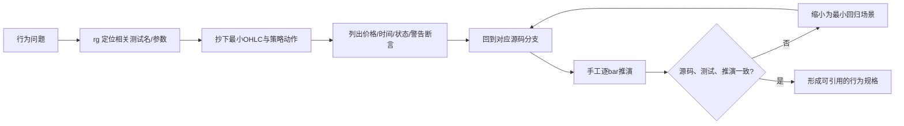

### 源码观察点

- 测试文件顶部把 `Backtest` 包装为 `finalize_trades=True` 的 partial；读单测时先确认用的是该别名还是原 `_Backtest`，否则会误判默认行为。
- 警告本身也是规格：margin 不足、同 bar 不可判定、末尾仍有活动 trade 都有测试价值。
- 同一个结果要同时观察 `_trades` 和 `_equity_curve`；只看最终收益可能掩盖 bar 时间或手续费归属错误。
- 回归测试常把 Open 与 Close 故意设成不同值，正是为了暴露 `trade_on_close` 时序。

### 常见误解与边界

- **误解：** 测试通过就证明模型贴近真实交易所。**事实：** 它只证明实现符合本仓库定义的模型。
- **误解：** 可以从大样本收益反推撮合正确。**事实：** 大结果可能由多个错误抵消；撮合应使用最小 OHLC 序列逐分支断言。
- **误解：** 只断言最终 cash 足够。**事实：** 还要断言 Entry/ExitPrice、bar、Commission、订单清理与警告。
- **边界：** 本文绑定 `cadcbe2`；上游行为变化后，应先重跑对应测试再更新文字。

### 动手推演或自测

从测试中任选一个 stop/limit 场景，不运行代码先手算，再运行单测核对。然后改变一项 OHLC，使原本同 bar 的两个触发分散到两根 bar，预测警告是否消失及 ExitBar 如何变化。

### 完成检查

- [ ] 我能从行为关键词快速定位相关测试，而不是整文件盲读。
- [ ] 我能把一个测试还原成逐 bar 事件表。
- [ ] 我能解释为何价格、时间、状态和警告都可能是独立断言。
- [ ] 我能为撮合缺陷设计一个不超过数根 bar 的最小回归测试。

## 四条调用链速查

### 指标链

`Strategy.init()` → `Strategy.I()` → 完整 `_Indicator` → `_indicator_warmup_nbars()` → `Backtest.run` 中逐步切片 → `Strategy.next()`

关键交接：`I()` 负责计算、验证与元数据；warmup 决定首个可交易 bar；主循环负责可见性。若把普通全长数组直接留在策略属性上，这条链的隔离就被绕过。

### 下单与成交链

`Strategy.buy()/sell()` → `_Broker.new_order()` → `orders` 队列 → `_Broker.next()` → `_process_orders()` → `_open_trade()` → `Trade` 与可选 SL/TP

关键交接：策略只表达订单意图；`new_order()` 校验价格顺序并排队；下一 broker tick 才判断 OHLC 触发、价格、净额、margin 与 commission。

### 平仓链

`Position.close()/Trade.close()` → 带 `parent_trade` 的反向 close `Order` → `_process_orders()` → `_reduce_trade()` 或 `_close_trade()` → `closed_trades`

关键交接：close API 不直接结算；全平时移除活动 trade 与两张附属单，结算退出 commission；部分平仓还要同步缩小剩余 trade 的 SL/TP size。

### 结果链

`broker._equity + broker.closed_trades` → `compute_stats()` → `_Stats`（含 `_equity_curve`、`_trades`、`_strategy`）→ `Backtest.plot()` → `_plotting.plot()`

关键交接：交易域到分析域的边界是不可再变更成交历史的 closed trades 和逐 bar equity；绘图只读取结果。

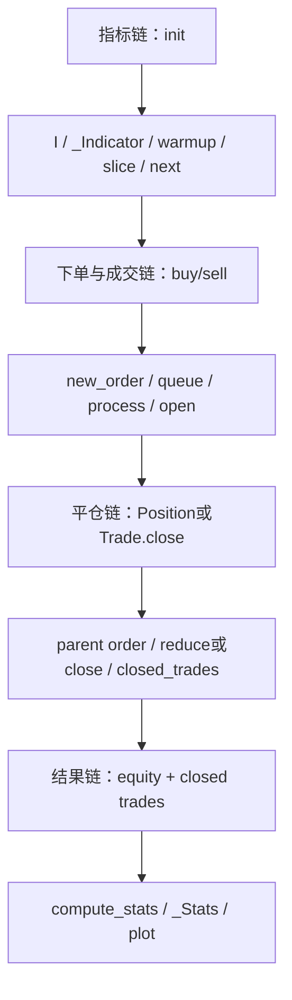

## 交易生命周期推演

下面给出一个可独立复算的 long 交易。参数：初始 cash = 10,000；`size=10` 单位；`spread=1%`；`commission=0.5%`（无固定费）；`margin=1`；`trade_on_close=False`；入场同时设 `SL=95`、`TP=110`。

| bar | OHLC | 事件 | broker 状态与计算 |
|---:|---|---|---|
| 0 | 100/101/99/100 | 仅用于提供历史 | 无订单 |
| 1 | 100/102/99/100 | `Strategy.next()` 调用 `buy(size=10, sl=95, tp=110)` | 新 `Order` 入队；当前调用不成交 |
| 2 | 100/108/99/106 | 先 `broker.next()` 处理市价单 | 基础价 100；long spread 后 `EntryPrice=101`；开仓 commission=`10×101×0.5%=5.05`；cash=`9,994.95`；建立 size 10 的 `Trade` 和两张 size -10 的 contingent 订单 |
| 2 递归检查 | Low=99，High=108 | 新 SL/TP 在同 bar 检查 | 95 与 110 都未触发；Close=106 时未实现 PnL=`10×(106-101)=50`；equity=`10,044.95` |
| 3 | 109/112/104/111 | TP limit=110 命中 | short limit 平仓基础价=`max(Open 109, limit 110)=110`；退出不再做 stand-alone entry spread 调整；退出 commission=`10×110×0.5%=5.50`；取消 SL |
| 3 结算 | — | trade 进入 `closed_trades` | 毛 PnL=`10×(110-101)=90`；总 commission=`10.55`；净 PnL=`79.45`；最终 cash/equity=`10,079.45` |

注意 `_process_orders()` 做容量检查时还会把单位 commission 计入 `adjusted_price_plus_commission`；本例指定整数 size，因此它只影响“margin 是否足够”，不改变单位数。若 size 写成 `.5`，单位数会按可用 margin、leverage、spread 与 commission 成本向下取整。

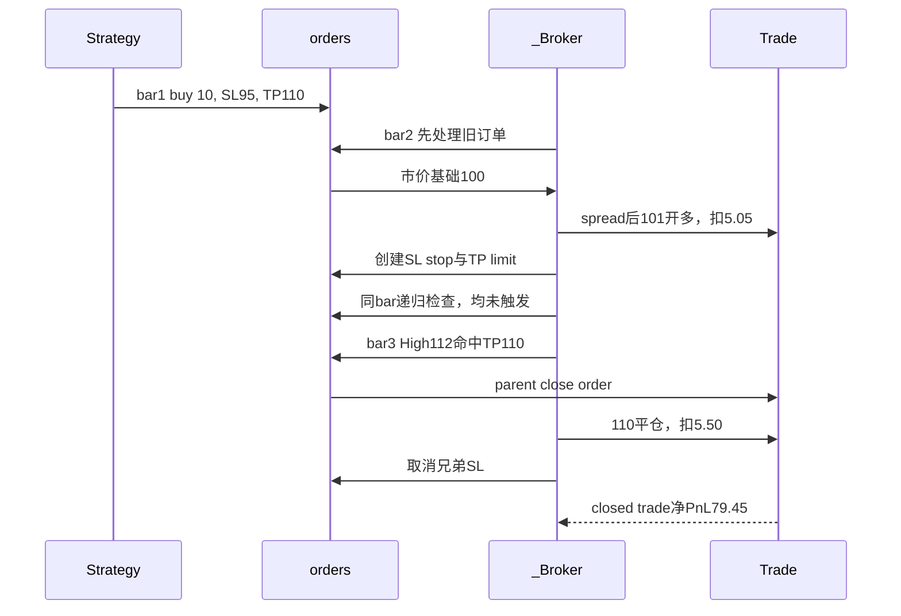

### 把同一个例子改成 SL 分支

若 bar 3 改为 `Open=94, High=97, Low=92, Close=93`，long SL=95 被触发。stop-market 用 `max(Open, stop)`，但对关闭 long 的订单方向是 short，因此使用 `min(Open, stop)=94`，即跳空后以更差的 94 退出。统计仍应保留原 `SL=95`。这正是“触发价格”和“成交价格”不可混为一谈的例子。

### 同 bar 实验

若 bar 2 改成 High=112、Low=94，则 market entry 后 SL 与 TP 都落在同一根 OHLC 范围内。仅凭 OHLC 不知道先到 94 还是先到 112；当前队列把 SL 放在 TP 前，形成保守执行。若父订单本身是 stop/limit 且同 bar 又覆盖附属单，代码的可判定分支与警告/延后分支不同。学习者必须把结果标为“框架假设”，不能称为真实盘中路径。

## 架构不变量与源码阅读记录模板

先用不变量检查理解是否完整：

1. `Order.size != 0`；方向由正负号表达，比例 size 与整数单位的语义不同。
2. long 必须满足 `SL < 参考入场价 < TP`，short 顺序相反。
3. `_Broker.orders`、`trades`、`closed_trades` 是交易集合的唯一事实来源；关闭 trade 必须从活动集合移除并加入已关闭集合。
4. 父 trade 全平时，其 SL/TP contingent orders 必须同步从队列移除。
5. 部分平仓后，剩余 trade 与其 SL/TP size 必须一致。
6. 当前 `_Data` 长度、`data` 列切片和策略 `_Indicator` 属性长度必须一致。
7. 每根 bar 先撮合旧订单，再执行策略决策；默认市价单不能在同一次 `Strategy.next()` 中即时成交。
8. commission 在开仓和平仓各结算一次；spread 进入方向调整后的开仓价格，两者不能重复或混算。
9. `_trades` 交易表与交易层指标只使用 `broker.closed_trades`；传入 `compute_stats` 的完整 equity 仍含活动 trade 的未实现盈亏，因此会影响 Equity Final、Return、回撤等权益类指标。`finalize_trades` 决定末尾活动 trade 是否被强制关闭并进入交易表与交易层指标。
10. worker 返回的精简公开统计与主进程最佳参数完整复跑之间必须分界清楚。

### 源码阅读记录模板

每读一个符号，都复制下面模板填写。最后两项会迫使你区分实现事实、模型假设和扩展位置。

```text
模块/对象：
源码文件与符号：
它负责什么：
它不负责什么：
输入与输出：
状态由谁拥有：
主要调用者：
关键不变量：
失败或警告条件：
对应行为测试：
这是实现事实还是模型假设：
如果扩展，最合适的边界在哪里：
```

练习：分别为 `_Data._set_length`、`_Broker._process_orders`、`compute_stats`、`Backtest._mp_task` 填一份；若“状态由谁拥有”四份都写成同一个答案，说明边界还没分清。

## 项目边界与迁移启示

Backtesting.py 最适合研究紧凑的、单标的、逐 bar 事件驱动回测内核。它把 Strategy API、Clock/Data Window、Broker & Fill Model、Accounting、Statistics & Reporting 切得足够清楚，适合学习和快速检验策略假设。

但它不是完整实盘系统：

| 能力 | 本项目内的边界 | 走向个人量化/实盘至少要新增 |
|---|---|---|
| 数据 | 接收已有 OHLC(V) DataFrame | 行情采集、版本化、复权、时区/交易日历、质量检测 |
| 撮合 | 单 bar OHLC 触发与确定性价格规则 | 逐笔/盘口、订单簿深度、排队、部分成交、冲击与滑点模型 |
| 执行 | 内存中的 `Order`/`Trade` | 券商/交易所网关、幂等 client ID、回报对账、拒单重试 |
| 状态 | 单次运行内存状态 | 持久化、崩溃恢复、事件日志、盘后对账 |
| 组合 | 单 Backtest 单数据；MultiBacktest 独立比较 | 共享现金、多资产净额、组合级 margin、风险预算与再平衡 |
| 风控 | margin 容量与破产停止 | 下单前/后风控、敞口限制、熔断、限频、人工接管 |
| 研究 | 参数 grid/SAMBO | 训练/验证/样本外、走步分析、多重检验控制、实验追踪 |
| 运维 | 本地运行与图表 | 调度、监控、告警、权限、密钥管理、审计 |

因此迁移时应保留边界而非复制全部实现：Strategy 只表达意图；Event Loop/Clock 控制因果时间；Broker & Fill Model 明确假设；Portfolio/Accounting 成为独立真相；Statistics/Reporting 只消费已确认事件。尤其不要把 `MultiBacktest` 误改几行就当成组合引擎——共享资金会把成交顺序、margin、风险和权益所有权全部提升到组合层。

### 边界自测

- [ ] 我能列出至少五项从研究回测到实盘必须新增的能力。
- [ ] 我能指出订单簿/逐笔需求为何不能只在 `_process_orders` 加一个参数解决。
- [ ] 我能说明共享资金多资产为何需要新的 portfolio/accounting 所有者。
- [ ] 我能区分模型可重复与市场高保真这两个目标。

## 学习完成验收

以下九项必须能脱离本文完成；勾选代表“能画、能讲、能推”，不是“读过”。

- [ ] 能在 **10 分钟内画出** 主要模块、对象所有权和从 API 到结果的关系。
- [ ] 能 **逐行讲清** `Backtest.run` 主循环中窗口、指标、broker、strategy 的执行顺序。
- [ ] 能解释为什么新建的 **默认市价单** 不会在当前 `Strategy.next()` 调用内成交，并比较 `trade_on_close`。
- [ ] 能手工推演一个带 **commission、spread、SL、TP** 的完整交易，算出成交价、两端手续费、现金与权益。
- [ ] 能指出至少一种绕过 `_Data` 保护而造成 **未来数据泄漏** 的方式。
- [ ] 能解释 stop/limit 父订单与附属单在 **同 bar 歧义** 下的可判定分支、警告与模型限制。
- [ ] 能从 `_Stats` 反向追溯任一 **主要指标的数据来源**，包括权益、交易表或时间索引假设。
- [ ] 能画出优化的 **共享内存与多进程** 边界，并说明 worker 只返回什么。
- [ ] 能列出 **至少五项** 从研究回测迁移到个人量化或实盘系统必须新增的能力。

额外口述题：

1. 为什么先 `strategy.next()` 后 `broker.next()` 会改变默认市价单的因果含义？
2. 为什么 `_Data` 的完整底层数组与安全的渐进访问并不矛盾？
3. 为什么 spread 放进价格、commission 放进现金，统计时仍必须一起进入净 PnL？
4. 为什么最佳参数需要在主进程完整复跑，而不能直接把 worker 的精简结果当最终 `_Stats`？
5. 如果图表显示异常但 `_trades` 正确，应优先检查哪一层；如果 `_trades` 的 ExitPrice 错误，又应检查哪一层？

## Fork 与上游同步

本学习仓库的约定是：`origin` 指向个人 Fork，`upstream` 指向原项目。建议让 `master` 保持可与上游比较，在独立学习分支保存本文、实验和批注。

安全的同步思路是“先获取，再比较，再显式整合”：

```text
origin   https://github.com/PancrasDuan/backtesting.py.git
upstream https://github.com/kernc/backtesting.py.git

git fetch upstream
git log --oneline --left-right master...upstream/master
# 确认变化后，再在学习分支选择 merge 或 rebase；不要直接覆盖学习记录。
```

本文的事实基线是 `cadcbe2`。同步后若 `backtesting/backtesting.py`、`_util.py` 或 `_stats.py` 有变化，应优先重核四条调用链、订单价格规则、统计字段和并行边界，并运行相关行为测试。文档与代码的“同步”不是只更新 commit 字符串，而是重新验证每个重要判断。

## 附录：源码索引与术语表

### 源码索引

| 主题 | 入口符号 | 文件 |
|---|---|---|
| 公开导出与进程池 | `Pool` | [`backtesting/__init__.py`](backtesting/__init__.py) |
| 策略参数 | `Strategy._check_params` | [`backtesting/backtesting.py`](backtesting/backtesting.py) |
| 指标声明 | `Strategy.I`、`_Indicator` | [`backtesting/backtesting.py`](backtesting/backtesting.py)、[`backtesting/_util.py`](backtesting/_util.py) |
| 数据窗口 | `_Data._set_length`、`_Data._update` | [`backtesting/_util.py`](backtesting/_util.py) |
| 预热 | `_indicator_warmup_nbars` | [`backtesting/_util.py`](backtesting/_util.py) |
| 领域对象 | `Position`、`Order`、`Trade` | [`backtesting/backtesting.py`](backtesting/backtesting.py) |
| 撮合 | `_Broker.next`、`_process_orders` | [`backtesting/backtesting.py`](backtesting/backtesting.py) |
| 核算 | `_open_trade`、`_reduce_trade`、`_close_trade` | [`backtesting/backtesting.py`](backtesting/backtesting.py) |
| 主循环 | `Backtest.__init__`、`Backtest.run` | [`backtesting/backtesting.py`](backtesting/backtesting.py) |
| 统计 | `compute_drawdown_duration_peaks`、`compute_stats`、`_Stats` | [`backtesting/_stats.py`](backtesting/_stats.py) |
| 绘图 | `plot`、`_maybe_resample_data` | [`backtesting/_plotting.py`](backtesting/_plotting.py) |
| 优化 | `Backtest.optimize`、`Backtest._mp_task` | [`backtesting/backtesting.py`](backtesting/backtesting.py) |
| 共享内存 | `SharedMemoryManager` | [`backtesting/_util.py`](backtesting/_util.py) |
| 多数据集 | `MultiBacktest` | [`backtesting/lib.py`](backtesting/lib.py) |
| 行为规格 | `TestBacktest`、`TestStrategy`、`TestRegressions` | [`backtesting/test/_test.py`](backtesting/test/_test.py) |

### 术语表

| 术语 | 本文中的精确定义 |
|---|---|
| OHLC(V) | 一根 bar 的 Open、High、Low、Close 与可选 Volume；没有 bar 内价格路径 |
| bar / K 线 | 主循环的最小时间步；撮合器在其 OHLC 范围上判断触发 |
| market order | 无 limit 且 stop 已不存在的订单；默认下一可用 Open 成交 |
| stop-market | stop 被 High/Low 触发后转成 market 的订单，跳空可能劣化 |
| stop-limit | 先达到 stop 才生效、再受 limit 约束的订单 |
| contingent order | 关联 parent `Trade` 的退出单，包括 SL、TP 与显式 close order |
| SL / TP | stop-loss / take-profit；在此实现中分别是反向 stop-market / limit 附属单 |
| spread | 按订单方向调整 stand-alone 成交价格的比例价差 |
| commission | 开仓和平仓分别结算的现金手续费，可固定、比例或函数式 |
| margin | 容量约束比例；`leverage = 1 / margin`，不是简单的现金扣款 |
| equity | `cash + 活动 trades 的未实现 PnL` |
| warmup | 非 scatter 指标前置 NaN 的最大长度，决定首次策略调用位置 |
| 同 bar | 多个触发价都落在同一根 OHLC 范围；若缺少逐笔路径，先后可能不可知 |
| SAMBO | `Backtest.optimize(method='sambo')` 使用的模型驱动参数搜索后端 |
| `_Stats` | 兼容 `pd.Series` 的最终结果容器，含公开指标和三个内部对象 |
| Fork / upstream | 个人远端副本 / 原项目远端；同步前应先 fetch 与比较 |

最后的学习建议：当一个结果令人意外时，按“数据可见窗口 → 订单队列 → 当前 OHLC 触发 → 价格与 commission/spread → Trade 集合 → equity → compute_stats”顺序排查。这个顺序与系统状态流一致，通常比从最终 Sharpe 倒猜更快找到真正的假设差异。
